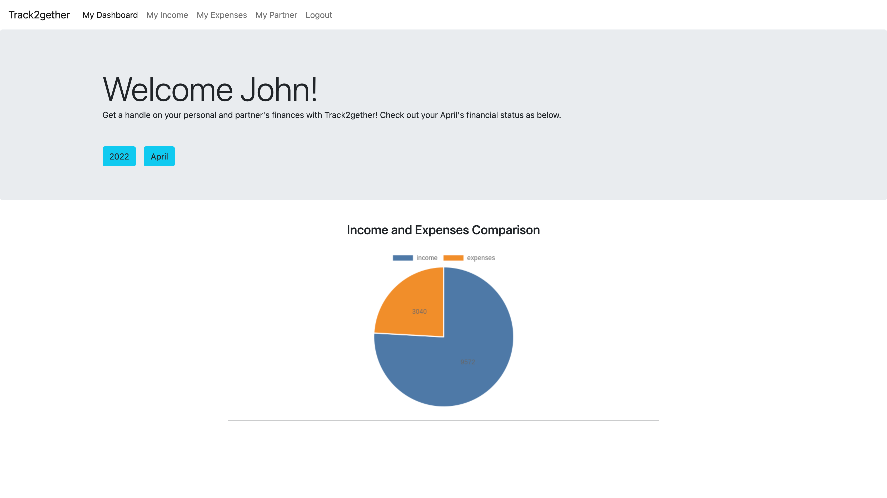

# Track2gether

Track2gether, a budget tracker, is an application that helps to keep an accurate record of your money inflow and ou​​tflow. It allows you to monitor and categorize your income sources and spendings. Without the help of a fancy financial planner, we provide an easy and light way to monitor and track your income and expenses for you to have a better idea on you and your partner’s financial status by providing visualized data on financial history.

## Track2gether Backend Repo
[Backend repo](https://github.com/SiyanGuo/track2gether-backend)

## Built With

* Angular 2+
* Bootstrap
* HTML
* QuickChart API

## Deployment

[Firebase](https://track2gether-98fc9.web.app)
Testing Account:
Email: john@gmail.com
Password: john123

## Screenshots

